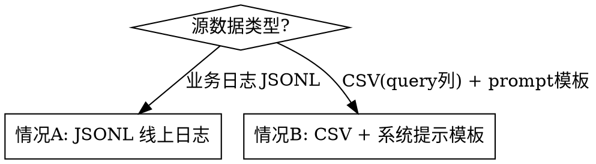

# Traffic Dataset Preparation

## Overview

将线上日志 JSONL 转换为 benchmark 可用的 CSV 数据集，核心是：峰值窗口采样 + 时间戳拼接 + 泊松插值放大 RPM。

所有工具来自 `third_party/data_analysis`，通过 `sys.path.insert(0, ".../third_party/data_analysis")` 引入。

---

## 两条路径



### 情况 A：JSONL 线上日志（6 步）

```
JSONL → [步骤1] DataConverter → _all.csv（按天）
                                      ↓
                        [步骤2] DataSampler → _selected_*.csv（峰值窗口）
                                      ↓
                        [步骤3] 时间戳拼接 → _stitched.csv（消除段间大间隔）
                                      ↓
                        [步骤4] DataInterpolator → _poisson_N_stitched.csv（放大 RPM）
                                      ↓
                        [步骤5] 脏数据过滤 → 覆盖写回（剔除 content 为 list 的行）
                                      ↓
                        [步骤6] README.md → 输出目录说明文档
```

### 情况 B：CSV 源数据 + 系统提示模板填充

适用场景：业务方提供带 `query` 列的 CSV（非 JSONL），且模型的输入需要将 query 嵌入固定的系统提示模板中。

```
CSV(query/times列) → [步骤1] times(ms) → income_time（Asia/Shanghai）
                                      ↓
                        [步骤2] 清洗 query + 填充 {{query}} 模板 → messages JSON
                                      ↓
                        [步骤3] 输出全量 _all.csv
                                      ↓
                        [步骤4] 峰值窗口采样 → _peak{N}min.csv（按需）
                                      ↓
                        [步骤5] 脏数据检查（通常无，messages 由程序构建）
                                      ↓
                        [步骤6] README.md → 输出目录说明文档
```

---

## 情况 B：核心实现

```python
# 步骤1: times(ms) → income_time（Asia/Shanghai 去时区）
df["income_time"] = (
    pd.to_datetime(df["times"].str.strip().astype(float).astype("int64"), unit="ms", utc=True)
    .dt.tz_convert("Asia/Shanghai")
    .dt.tz_localize(None)
)

# 步骤2: 填充 {{query}} 模板 → messages
system_prompt_template = Path(SYSTEM_PROMPT_FILE).read_text(encoding="utf-8")
# 确认占位符存在
assert "{{query}}" in system_prompt_template

def build_messages(query: str) -> str:
    filled = system_prompt_template.replace("{{query}}", str(query).strip())
    return json.dumps([{"role": "system", "content": filled}], ensure_ascii=False)

df["messages"] = df["query"].apply(build_messages)

# 步骤4: 峰值窗口采样（根据流量分析确定时间段）
df_peak = df[(df["income_time"] >= PEAK_START) & (df["income_time"] <= PEAK_END)]
```

> **⚠️ 文件体积警告**：每行 messages 包含完整系统提示（通常数千字符），全量 CSV 体积会比 JSONL 源文件大 5~10 倍。优先用峰值窗口采样文件做压测，全量文件仅用于需要时。

---

## 情况 A：关键 API

```python
import sys
sys.path.insert(0, "/path/to/third_party/data_analysis")

from scripts.data_processor.config.settings import GlobalConfig
from scripts.data_processor.modules.converter import DataConverter
from scripts.data_processor.modules.sampler import DataSampler
from scripts.data_processor.modules.interpolator import DataInterpolator

# 步骤1: JSONL → CSV（read_only_time=False 拉取完整 prompt 内容）
cfg = GlobalConfig(
    input_files=[JSONL_FILE],
    output_dir=OUTPUT_DIR,
    model_name=MODEL_NAME,
    model_list=(MODEL_NAME, "模型别名"),
    read_only_time=False,   # 生产默认 False（完整内容）；True 仅用于调试时快速预览时间戳
    auto_confirm=True,
)
DataConverter(cfg).run([JSONL_FILE], skip_confirmation=True)

# 步骤2: 峰值窗口采样
cfg2 = GlobalConfig(output_dir=OUTPUT_DIR, model_name=MODEL_NAME,
                    model_list=(MODEL_NAME,), read_only_time=False)
sampler = DataSampler(cfg2)
df_win = sampler._select_data(start_dt, end_dt)   # 返回 DataFrame

# 步骤4: 泊松插值
cfg3 = GlobalConfig(output_dir=OUTPUT_DIR, model_name=MODEL_NAME,
                    interpolate_peak_target=TARGET_RPM)
DataInterpolator(cfg3).interpolate_by_peak(
    input_file=str(stitched_csv),
    source_file=str(stitched_csv),  # 拼接后的 CSV 同时作为数据源池
    output_file=str(output_csv),
    peak_target=TARGET_RPM,
    time_column="income_time",
    plot_html=str(plot_html),       # 生成对比图（可选）
)
```

---

## 步骤3：时间戳拼接（手动实现）

当峰值数据来自多段且段间存在 >5min 大间隔时，必须先拼接再插值，否则插值会产生超长空档。

```python
diffs = df["income_time"].diff()
big_gap_indices = diffs[diffs > pd.Timedelta("5min")].index.tolist()

anchor_end = None
segments = []
for i, (s, e) in enumerate(seg_ranges):
    seg = df.iloc[s:e].copy()
    if i == 0:
        anchor_end = seg["income_time"].iloc[-1]
    else:
        offset = (anchor_end + pd.Timedelta("1s")) - seg["income_time"].iloc[0]
        seg["income_time"] += offset
        anchor_end = seg["income_time"].iloc[-1]
    segments.append(seg)
```

---

## 步骤5：脏数据过滤

benchmark 的 Jinja chat template 不接受 `content` 为 list 的行（多模态格式），会抛 `TypeError: can only concatenate str (not "list") to str`。

```python
def has_list_content(messages_str: str) -> bool:
    try:
        msgs = json.loads(messages_str)
    except Exception:
        msgs = ast.literal_eval(messages_str)
    return any(isinstance(m.get("content"), list) for m in msgs if isinstance(m, dict))

df = df[~df["messages"].apply(has_list_content)].reset_index(drop=True)
```

---

## 步骤6：README 输出说明文档

每次处理完成后，在输出目录写入 `README.md`，记录本次交付的完整上下文。

**必须包含的内容：**

```markdown
## 数据来源
- 原始文件路径、行数、时间范围
- 模型名称及所有别名（model_list）
- 处理工具版本

## 处理流程（逐步说明）
- 每步的关键参数：TARGET_RPM、PEAK_WINDOWS、SEG_GAP 等
- 每步的输入/输出行数和峰值 RPM 变化

## 核心交付文件（重点标注）
| 文件名 | 用途 | 行数 |
- _all.csv             ← 全量基准（评估用）
- _stitched.csv        ← 峰值拼接（原始流量参考）
- _poisson_N_stitched.csv  ← 压测数据（推荐使用，加粗标注）
- _compare.html        ← 插值对比可视化

## 中间文件（说明不直接使用）
- 按天分片、各窗口采样文件

## 验证结论
- 与基准/同事数据的对比结果
- 各步骤验证检查项是否通过
```

---

## 验证 Checklist（每步后必查）

| 步骤 | 检查项 |
|------|--------|
| 转换后 | `messages` 列有内容（非空）的行数占比；`_all.csv` 行数与 `wc -l input.jsonl` 接近 |
| 采样后 | 峰值 RPM 是否符合预期；各段起止时间 |
| 拼接后 | `df.diff()[diff > 5min]` 数量应为 0 |
| 插值后 | 峰值 RPM 达到 `TARGET_RPM`；messages 有内容行数 |
| 过滤后 | 行数变化量；输出文件大小 |
| README | 数据来源、model_list 别名、逐步参数、核心文件加粗标注、验证结论均已填写 |

---

## ⚠️ 模型别名陷阱（高优先级）

同一个模型在 JSONL 的 `extra_data.ai_info.model` 字段可能有**多种写法**（正式名 + 中文别名），只指定一种会丢失大量数据。

**必须在 `model_list` 中同时列出所有别名：**

```python
# 错误：只用模型名，丢失 ~70% 数据
GlobalConfig(model_list=("xinghan-hepan-72b-v1-2",), ...)

# 正确：同时列出所有别名
GlobalConfig(model_list=("xinghan-hepan-72b-v1-2", "星盘合盘"), ...)
```

**CLI 用法**：`data-processor convert -m` 现已支持逗号分隔多个别名，直接传入即可：

```bash
data-processor convert -i data.jsonl -o output/ -m "xinghan-hepan-72b-v1-2,星盘合盘" -y
```

**验证方法**：转换后检查 `_all.csv` 行数是否与 `wc -l input.jsonl` 的行数接近。如果明显偏低（如只有 1/3），说明漏了别名。

---

## 常见错误

| 错误 | 路径 | 根因 | 修复 |
|------|------|------|------|
| `_all.csv` 行数远少于 JSONL 行数 | A | `model_list` 未包含所有别名（如中文名）| 追加别名，重跑 convert |
| `TypeError: can only concatenate str (not "list")` | A | 多模态脏行未过滤 | 步骤5 过滤后再跑 benchmark |
| 插值后仍有大间隔 | A | 拼接步骤被跳过 | 先拼接再插值 |
| `sampler._select_data` 返回空 | A | `read_only_time` 与 converter 不一致 | 始终用 `False`；`True` 仅调试 |
| COS URL 拉取超时 | A | 网络或并发过高 | 降低并发参数或分批 |
| `{{query}}` 未替换，messages 含原始占位符 | B | `system_prompt_template` 路径错误或文件读取失败 | 确认路径，检查 `assert "{{query}}" in template` |
| 全量 _all.csv 超过 5 GB | B | 系统提示 per-row 展开后体积爆炸 | 压测使用峰值窗口采样文件 `_peak{N}min.csv` |
| `income_time` 时区偏移 8 小时 | B | 未做 `tz_convert("Asia/Shanghai")` | 加 `.dt.tz_convert("Asia/Shanghai").dt.tz_localize(None)` |
| `KeyError: 'prompt'`（benchmark 启动报错）| A/B | benchmark 工具强制要求 CSV 有 `prompt` 列 | 输出列必须包含空 `prompt`：`OUTPUT_COLS = ["income_time", "prompt", "messages", ...]` |

---

## 文件命名约定

```
{MODEL_NAME}_all.csv                                  ← 全量合并（按天拼，排序）
{MODEL_NAME}_selected_combined_Ndays_peak.csv         ← 峰值窗口合并
{MODEL_NAME}_selected_combined_Ndays_peak_stitched.csv ← 拼接后
{MODEL_NAME}_selected_..._poisson_{RPM}_stitched.csv  ← 最终可用
{MODEL_NAME}_poisson_{RPM}_compare.html               ← 插值对比图
```
