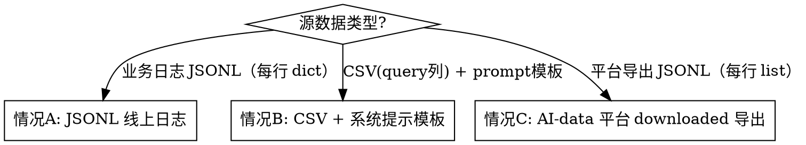

# Traffic Dataset Preparation

## Overview

将线上日志 JSONL 转换为 benchmark 可用的 CSV 数据集，核心是：峰值窗口采样 + 时间戳拼接 + 泊松插值放大 RPM。

所有工具来自 `third_party/data_analysis`，通过 `sys.path.insert(0, ".../third_party/data_analysis")` 引入。

---

## 三条路径



> **快速判断格式**：`head -c 2 file.jsonl`
> - 输出 `{"` → 情况A（每行是 dict）
> - 输出 `[{` → 情况C（每行是 list，AI-data 平台导出）
> - 无 JSONL，有 CSV → 情况B

### 情况 A：JSONL 线上日志（6 步 + 步骤1.5）

```
JSONL → [步骤1] DataConverter → 日期分片 CSV（_2026-MM-DD.csv）+ _all.csv（3列索引，不可用）
                                      ↓
                     [步骤1.5] 合并日期分片 → 覆盖写回 _all.csv（6列完整数据）  ← 条件执行（见下）
                                      ↓
                        [步骤2] DataSampler → _selected_*.csv（峰值窗口）
                                      ↓
                        [步骤3] 时间戳拼接 → _stitched.csv（消除段间大间隔）
                                      ↓
                        [步骤4] DataInterpolator → _poisson_N_stitched.csv（放大 RPM）
                                      ↓
                        [步骤5] 脏数据过滤 → 覆盖写回（剔除 content 为 list 的行）
                                      ↓
                        [步骤6] README.md → 输出目录说明文档
```

> **步骤1.5 执行条件**：
>
> | 场景 | 是否需要步骤1.5 |
> |------|----------------|
> | 需要把 `_all.csv` 直接传给 benchmark 工具（全量数据压测）| **必须执行** |
> | 只走 DataSampler 采样管道（步骤2），不需要 `_all.csv` 全量数据 | **可跳过**（DataSampler 直接读日期分片 CSV，不依赖 `_all.csv` 内容）|
>
> **判断方法**：若下一步是 `DataSampler._select_data(start_dt, end_dt)` 峰值采样，可跳过步骤1.5；
> 若下一步是直接把 `_all.csv` 传给 benchmark，**必须先执行步骤1.5**。
>
> **⚠️ DataConverter `_all.csv` 陷阱**：DataConverter 原生输出的 `_all.csv` 是 3 列内部索引文件
> (`income_time`, `file_suffix`, `original_index`)，**不含 `messages` / `old_response`**。
> 直接传给 benchmark 工具会触发 `KeyError: 'old_response'`。
> 需要全量 benchmark 时，必须执行步骤1.5 将日期分片合并覆盖写回为 6 列完整 `_all.csv`。

### 情况 B：CSV 源数据 + 系统提示模板填充

适用场景：业务方提供带 `query` 列的 CSV（非 JSONL），且模型的输入需要将 query 嵌入固定的系统提示模板中。

```
CSV(query/times列) → [步骤1] times(ms) → income_time（Asia/Shanghai）
                                      ↓
                        [步骤2] 清洗 query + 填充 {{query}} 模板 → messages JSON
                                      ↓
                        [步骤3] 输出全量 _all.csv
                                      ↓
                        [步骤4] 峰值窗口采样 → _peak{N}min.csv（按需）
                                      ↓
                        [步骤5] 脏数据检查（通常无，messages 由程序构建）
                                      ↓
                        [步骤6] README.md → 输出目录说明文档
```

---

### 情况 C：AI-data 平台 downloaded 导出格式（6 步，跳过 DataConverter 和 DataSampler）

```
downloaded JSONL（每行=list）→ [步骤1] 探查别名分布 → 确认 MODEL_LIST_SET
                                         ↓
                        [步骤1+1.5 合并] 直接 pandas 解析 → 日期分片 CSV + _all.csv（6列）
                                         ↓
                           [步骤2] pandas 直接过滤峰值窗口 → _selected_*.csv
                                         ↓
                           [步骤3] 时间戳拼接 → _stitched.csv（消除段间大间隔）
                                         ↓
                           [步骤4] DataInterpolator → _poisson_N_stitched.csv（放大 RPM）
                                         ↓
                           [步骤5] 脏数据过滤 → 覆盖写回
                                         ↓
                           [步骤6] README.md → 输出目录说明文档
```

> **⚠️ 不能使用 DataConverter 和 DataSampler**：
> - DataConverter 要求每行是 dict（含 `messages` key），received list → `AttributeError: 'list' object has no attribute 'get'`
> - DataSampler 依赖 DataConverter 生成的 `file_suffix` 索引列，情况C 的 CSV 不含此列 → 调用报错
> - 情况C 全程用 pandas 直接操作，DataInterpolator 仍可正常使用

#### 情况C：数据格式说明

AI-data 平台 downloaded 导出的每行结构：
```json
[
  {"role": "b",  "content": "用户消息", "time": 1768545951000, "_id": "...", ...},
  {"role": "ib", "content": "内部八字数据", ...},
  {"role": "a",  "content": "模型回复", "prompt": "[{\"role\":\"system\",...}]",
   "extra_data": {"ai_info": {"model": "八字深度", "suffix": "八字深度"}}, "time": ...}
]
```

| 字段 | 用途 | CSV 列 |
|------|------|--------|
| `role='b'.time`（ms）| 请求时间戳 | `income_time` |
| `role='a'.prompt` | 完整 messages JSON（含 system+user）| `messages` |
| `role='a'.content` | 模型历史回复 | `old_response` |
| `role='b'._id` | 用户 ID | `user_id` |
| `extra_data.ai_info.model` | 模型别名过滤字段 | — |

#### 步骤0：探查别名分布（必做，避免数据丢失）

```python
import json
from collections import Counter

model_names = Counter()
with open(JSONL_FILE) as f:
    for line in f:
        try:
            msgs = json.loads(line.strip())
            for msg in msgs:
                if msg.get("role") == "a":
                    ai_info = msg.get("extra_data", {}).get("ai_info", {})
                    m = ai_info.get("model") or ai_info.get("suffix")
                    if m:
                        model_names[m] += 1
        except:
            pass

print("模型别名分布:", model_names.most_common(10))
# 将所有出现的别名都加入 MODEL_LIST_SET
```

#### 步骤1+1.5（合并）：直接解析 downloaded JSONL → 日期分片 CSV + _all.csv

```python
import json, datetime as dt_module
import pandas as pd
from pathlib import Path

MODEL_LIST_SET = {"xinghan-xxx-model", "中文别名"}   # ← 由步骤0确认
OUTPUT_COLS = ["income_time", "prompt", "messages", "old_response", "user_id", "line_num"]

rows_by_day: dict[str, list] = {}

with open(JSONL_FILE, encoding="utf-8") as jf:
    for idx, raw in enumerate(jf):
        line_num = idx + 1
        try:
            msgs = json.loads(raw.strip())
            if not isinstance(msgs, list):
                continue

            # 找最后一条 role='a' 且模型别名匹配的消息
            assistant_msg = None
            for m in reversed(msgs):
                if m.get("role") == "a" and m.get("prompt"):
                    ai_info = m.get("extra_data", {}).get("ai_info", {})
                    model_val = ai_info.get("model") or ai_info.get("suffix") or ""
                    if model_val in MODEL_LIST_SET:
                        assistant_msg = m
                        break

            if assistant_msg is None:
                continue

            # 找第一条 role='b' 取时间戳
            user_msg = next((m for m in msgs if m.get("role") == "b"), None)
            if not user_msg or not user_msg.get("time"):
                continue

            # ms → Asia/Shanghai datetime（去时区）
            income_dt = dt_module.datetime.fromtimestamp(
                user_msg["time"] / 1000,
                tz=dt_module.timezone(dt_module.timedelta(hours=8))
            ).replace(tzinfo=None)

            rows_by_day.setdefault(income_dt.strftime("%Y-%m-%d"), []).append({
                "income_time": income_dt.strftime("%Y-%m-%d %H:%M:%S"),
                "prompt":      "",                              # benchmark 要求列存在，留空
                "messages":    assistant_msg.get("prompt", ""),
                "old_response": assistant_msg.get("content", "") or "",
                "user_id":     user_msg.get("_id", ""),
                "line_num":    line_num,
            })
        except (json.JSONDecodeError, KeyError, TypeError):
            pass

# 写日期分片 CSV
all_dfs = []
for day_key in sorted(rows_by_day):
    df_day = pd.DataFrame(rows_by_day[day_key], columns=OUTPUT_COLS)
    df_day = df_day.sort_values("income_time").reset_index(drop=True)
    day_csv = Path(OUTPUT_DIR) / f"{MODEL_NAME}_{day_key}.csv"
    df_day.to_csv(day_csv, index=False)
    all_dfs.append(df_day)

# 写 _all.csv（6 列全量，已含 old_response，可直接用于 benchmark）
df_full = pd.concat(all_dfs, ignore_index=True).sort_values("income_time").reset_index(drop=True)
df_full.to_csv(Path(OUTPUT_DIR) / f"{MODEL_NAME}_all.csv", index=False)
print(f"总行数: {len(df_full)}, old_response 非空率: {(df_full['old_response']!='').mean():.1%}")
```

#### 步骤2：pandas 直接过滤峰值窗口（替代 DataSampler）

```python
df_all = pd.concat([pd.read_csv(p) for p in sorted(
    Path(OUTPUT_DIR).glob(f"{MODEL_NAME}_2[0-9][0-9][0-9]-*.csv")
)], ignore_index=True)
df_all["income_time"] = pd.to_datetime(df_all["income_time"])

PEAK_WINDOWS = [
    ("2026-01-16 00:00:00", "2026-01-16 00:20:00", "凌晨峰值"),
    ("2026-01-16 22:49:00", "2026-01-16 23:09:00", "夜间峰值"),
]

sampled_frames = []
for start_str, end_str, desc in PEAK_WINDOWS:
    mask = (df_all["income_time"] >= start_str) & (df_all["income_time"] <= end_str)
    df_win = df_all[mask].copy().reset_index(drop=True)
    print(f"{desc}: {len(df_win)} 条, 峰值 RPM={df_win['income_time'].dt.floor('min').value_counts().max()}")
    sampled_frames.append(df_win)

df_combined = pd.concat(sampled_frames, ignore_index=True).sort_values("income_time").reset_index(drop=True)
```

步骤3~6 与情况A 完全相同，DataInterpolator 可正常使用。

---

## 情况 B：核心实现

```python
# 步骤1: times(ms) → income_time（Asia/Shanghai 去时区）
df["income_time"] = (
    pd.to_datetime(df["times"].str.strip().astype(float).astype("int64"), unit="ms", utc=True)
    .dt.tz_convert("Asia/Shanghai")
    .dt.tz_localize(None)
)

# 步骤2: 填充 {{query}} 模板 → messages
system_prompt_template = Path(SYSTEM_PROMPT_FILE).read_text(encoding="utf-8")
# 确认占位符存在
assert "{{query}}" in system_prompt_template

def build_messages(query: str) -> str:
    filled = system_prompt_template.replace("{{query}}", str(query).strip())
    return json.dumps([{"role": "system", "content": filled}], ensure_ascii=False)

df["messages"] = df["query"].apply(build_messages)

# 步骤4: 峰值窗口采样（根据流量分析确定时间段）
df_peak = df[(df["income_time"] >= PEAK_START) & (df["income_time"] <= PEAK_END)]
```

> **⚠️ 文件体积警告**：每行 messages 包含完整系统提示（通常数千字符），全量 CSV 体积会比 JSONL 源文件大 5~10 倍。优先用峰值窗口采样文件做压测，全量文件仅用于需要时。

---

## 情况 A：关键 API

```python
import sys
sys.path.insert(0, "/path/to/third_party/data_analysis")

from scripts.data_processor.config.settings import GlobalConfig
from scripts.data_processor.modules.converter import DataConverter
from scripts.data_processor.modules.sampler import DataSampler
from scripts.data_processor.modules.interpolator import DataInterpolator

# 步骤1: JSONL → 日期分片 CSV（read_only_time=False 拉取完整 prompt 内容）
cfg = GlobalConfig(
    input_files=[JSONL_FILE],
    output_dir=OUTPUT_DIR,
    model_name=MODEL_NAME,
    model_list=(MODEL_NAME, "模型别名"),
    read_only_time=False,   # 生产默认 False（完整内容）；True 仅用于调试时快速预览时间戳
    auto_confirm=True,
)
DataConverter(cfg).run([JSONL_FILE], skip_confirmation=True)

# 步骤1.5: 合并日期分片 → 覆盖写回 _all.csv（6 列完整数据）
# DataConverter 的 _all.csv 是 3 列索引文件，不可直接用于 benchmark，必须执行此步骤
all_csv = Path(OUTPUT_DIR) / f"{MODEL_NAME}_all.csv"
day_csvs = sorted(Path(OUTPUT_DIR).glob(f"{MODEL_NAME}_2[0-9][0-9][0-9]-*.csv"))
df_full = pd.concat([pd.read_csv(p) for p in day_csvs], ignore_index=True)
df_full = df_full.sort_values("income_time").reset_index(drop=True)
df_full["old_response"] = df_full["old_response"].fillna("")
df_full.to_csv(all_csv, index=False)
# 此后 _all.csv 即为 6 列完整数据（income_time, prompt, messages, old_response, user_id, line_num）

# 步骤2: 峰值窗口采样
cfg2 = GlobalConfig(output_dir=OUTPUT_DIR, model_name=MODEL_NAME,
                    model_list=(MODEL_NAME,), read_only_time=False)
sampler = DataSampler(cfg2)
df_win = sampler._select_data(start_dt, end_dt)   # 返回 DataFrame

# 步骤4: 泊松插值
cfg3 = GlobalConfig(output_dir=OUTPUT_DIR, model_name=MODEL_NAME,
                    interpolate_peak_target=TARGET_RPM)
DataInterpolator(cfg3).interpolate_by_peak(
    input_file=str(stitched_csv),
    source_file=str(stitched_csv),  # 拼接后的 CSV 同时作为数据源池
    output_file=str(output_csv),
    peak_target=TARGET_RPM,
    time_column="income_time",
    plot_html=str(plot_html),       # 生成对比图（可选）
)
```

---

## 步骤3：时间戳拼接（手动实现）

当峰值数据来自多段且段间存在 >5min 大间隔时，必须先拼接再插值，否则插值会产生超长空档。

```python
diffs = df["income_time"].diff()
big_gap_indices = diffs[diffs > pd.Timedelta("5min")].index.tolist()

anchor_end = None
segments = []
for i, (s, e) in enumerate(seg_ranges):
    seg = df.iloc[s:e].copy()
    if i == 0:
        anchor_end = seg["income_time"].iloc[-1]
    else:
        offset = (anchor_end + pd.Timedelta("1s")) - seg["income_time"].iloc[0]
        seg["income_time"] += offset
        anchor_end = seg["income_time"].iloc[-1]
    segments.append(seg)
```

---

## 步骤5：脏数据过滤

benchmark 的 Jinja chat template 不接受 `content` 为 list 的行（多模态格式），会抛 `TypeError: can only concatenate str (not "list") to str`。

```python
def has_list_content(messages_str: str) -> bool:
    try:
        msgs = json.loads(messages_str)
    except Exception:
        msgs = ast.literal_eval(messages_str)
    return any(isinstance(m.get("content"), list) for m in msgs if isinstance(m, dict))

df = df[~df["messages"].apply(has_list_content)].reset_index(drop=True)
```

---

## 步骤6：README 输出说明文档

每次处理完成后，在输出目录写入 `README.md`，记录本次交付的完整上下文。

**必须包含的内容：**

```markdown
## 数据来源
- 原始文件路径、行数、时间范围
- 模型名称及所有别名（model_list）
- 处理工具版本

## 处理流程（逐步说明）
- 每步的关键参数：TARGET_RPM、PEAK_WINDOWS、SEG_GAP 等
- 每步的输入/输出行数和峰值 RPM 变化

## 核心交付文件（重点标注）
| 文件名 | 用途 | 行数 |
- _all.csv             ← 全量基准（评估用）
- _stitched.csv        ← 峰值拼接（原始流量参考）
- _poisson_N_stitched.csv  ← 压测数据（推荐使用，加粗标注）
- _compare.html        ← 插值对比可视化

## 中间文件（说明不直接使用）
- 按天分片、各窗口采样文件

## 验证结论
- 与基准/同事数据的对比结果
- 各步骤验证检查项是否通过
```

---

## 验证 Checklist（每步后必查）

| 步骤 | 检查项 |
|------|--------|
| 格式判断（入口）| `head -c 2 file.jsonl` 确认是 `{"` (情况A) 还是 `[{` (情况C) |
| 转换后（步骤1，情况A）| 日期分片 CSV 已生成；DataConverter `_all.csv` 行数接近 `wc -l input.jsonl`（此时列只有 3 列，正常）|
| 转换后（步骤1+1.5，情况C）| `_all.csv` 已是 6 列；`old_response` 非空率接近 100%；行数 ≥ 期望筛选量（若偏低，检查 MODEL_LIST_SET 是否漏别名）|
| 合并后（步骤1.5） | **若执行**：`_all.csv` 列变为 6 列；`old_response` 非空率应接近 100%（DataConverter **不**自动提取模型回复，需在步骤1.5 手动从 JSONL 按 `line_num` 回填：`line_num = jsonl_row_index + 1`，提取 `messages[role='a'].content`）；行数与日期分片之和一致。**若跳过（纯采样路径）**：确认下一步为 DataSampler，且全流程中不直接使用 `_all.csv` |
| 采样后 | 峰值 RPM 是否符合预期；各段起止时间 |
| 拼接后 | `df.diff()[diff > 5min]` 数量应为 0 |
| 插值后 | 峰值 RPM 达到 `TARGET_RPM`；messages 有内容行数 |
| 过滤后 | 行数变化量；输出文件大小 |
| README | 数据来源、model_list 别名、逐步参数、核心文件加粗标注、验证结论均已填写 |

---

## ⚠️ 模型别名陷阱（高优先级）

同一个模型在 JSONL 的 `extra_data.ai_info.model` 字段可能有**多种写法**（正式名 + 中文别名），只指定一种会丢失大量数据。

**必须在 `model_list` 中同时列出所有别名：**

```python
# 错误：只用模型名，丢失 ~70% 数据
GlobalConfig(model_list=("xinghan-hepan-72b-v1-2",), ...)

# 正确：同时列出所有别名
GlobalConfig(model_list=("xinghan-hepan-72b-v1-2", "星盘合盘"), ...)
```

**CLI 用法**：`data-processor convert -m` 现已支持逗号分隔多个别名，直接传入即可：

```bash
data-processor convert -i data.jsonl -o output/ -m "xinghan-hepan-72b-v1-2,星盘合盘" -y
```

**验证方法**：转换后检查 `_all.csv` 行数是否与 `wc -l input.jsonl` 的行数接近。如果明显偏低（如只有 1/3），说明漏了别名。

---

## 常见错误

| 错误 | 路径 | 根因 | 修复 |
|------|------|------|------|
| `AttributeError: 'list' object has no attribute 'get'` | A | JSONL 每行是 list（情况C 格式），被误当情况A 处理 | 用 `head -c 2 file.jsonl` 检查格式；若是 `[{` 则切换到情况C 自定义解析 |
| `KeyError: 'file_suffix'`（DataSampler 调用报错）| C | 情况C 的 CSV 不含 DataConverter 索引列 | 情况C 跳过 DataSampler，直接用 pandas 过滤峰值窗口（见情况C 步骤2）|
| `_all.csv` 行数远少于 JSONL 行数 | A/C | `model_list` 未包含所有别名（如中文名）| 先运行别名探查（步骤0），追加别名后重跑 |
| `TypeError: can only concatenate str (not "list")` | A | 多模态脏行未过滤 | 步骤5 过滤后再跑 benchmark |
| 插值后仍有大间隔 | A | 拼接步骤被跳过 | 先拼接再插值 |
| `sampler._select_data` 返回空 | A | `read_only_time` 与 converter 不一致 | 始终用 `False`；`True` 仅调试 |
| COS URL 拉取超时 | A | 网络或并发过高 | 降低并发参数或分批 |
| `{{query}}` 未替换，messages 含原始占位符 | B | `system_prompt_template` 路径错误或文件读取失败 | 确认路径，检查 `assert "{{query}}" in template` |
| 全量 _all.csv 超过 5 GB | B | 系统提示 per-row 展开后体积爆炸 | 压测使用峰值窗口采样文件 `_peak{N}min.csv` |
| `income_time` 时区偏移 8 小时 | B | 未做 `tz_convert("Asia/Shanghai")` | 加 `.dt.tz_convert("Asia/Shanghai").dt.tz_localize(None)` |
| `KeyError: 'prompt'`（benchmark 启动报错）| A/B | benchmark 工具强制要求 CSV 有 `prompt` 列 | 输出列必须包含空 `prompt`：`OUTPUT_COLS = ["income_time", "prompt", "messages", ...]` |
| `KeyError: 'old_response'`（benchmark 启动报错）| A | 直接使用 DataConverter 输出的 `_all.csv`（3 列索引文件，无 `messages`/`old_response`）| 执行步骤1.5 合并日期分片覆盖写回，或手动合并 `_2026-MM-DD.csv` 文件 |
| `old_response` 全为空（Phase 0 / 输出长度分析无结果）| A | DataConverter **不**提取模型历史回复，步骤1.5 的 `fillna("")` 只填空串不填内容 | 在步骤1.5 合并后从原始 JSONL 按 `line_num`（= jsonl行索引+1）提取 `messages[role='a'].content` 回填；同时覆盖写回日期分片 CSV，确保下游 DataSampler 采样文件也含 `old_response` |

---

## 新模式执行方式（推荐）

> 适用于 2026-03-18 之后接入的新模型。旧模型专属处理脚本仍可用，但不再维护。

**Step 1**：确认 `configs/models/<model>/<tp>.env` 中数据处理参数已填写：

```bash
grep -E "DATA_FORMAT|INPUT_JSONL|OUTPUT_DIR|MODEL_LIST|DATASET_PATH" \
    configs/models/<model>/8tp.env
```

**.env 文件中数据处理参数说明**：

| 参数 | 枚举值 | 说明 |
|------|--------|------|
| `DATA_FORMAT` | `standard` | messages 内联 dict-list（每行是 dict，guoxue/ziwei 早期版本），走 DataConverter pipeline |
| `DATA_FORMAT` | `downloaded` | AI-data 平台 downloaded 导出格式（每行是 list），跳过 DataConverter/DataSampler，用情况C 自定义解析 |
| `DATA_FORMAT` | `indexed` | messages 是 COS URL（chart 类型），先下载再转换 |
| `INPUT_JSONL` | — | 原始索引/数据 JSONL 路径（相对 PROJECT_DIR）|
| `OUTPUT_DIR` | — | 处理产物输出目录 |
| `MODEL_LIST` | — | 模型别名，逗号分隔，必须覆盖所有写法（⚠️ 高频踩坑）|
| `DATASET_PATH` | — | 最终 benchmark 数据集路径（`_all.csv` 或 `_poisson_*_stitched.csv`）|
| `DATASET_TYPE` | `all` | QPS sweep 用，无需峰值采样 |
| `DATASET_TYPE` | `peak` | replay 用，需要泊松插值（配合 `TARGET_PEAK_RPM`）|

**Step 2**：执行

```bash
# 标准模式（guoxue/ziwei）
python scripts/data/process.py --env configs/models/<model>/8tp.env

# 索引模式（chart 类型）—— process.py 自动调用 download_by_indices.py
python scripts/data/process.py --env configs/models/<model>/8tp.env
```

**Step 3**：验证

```bash
# 检查输出行数（应与业务数据量匹配）
wc -l datas/output_<model>/<model>_all.csv

# 如果行数明显偏低，检查 MODEL_LIST 是否漏了别名
grep "MODEL_LIST" configs/models/<model>/8tp.env
```

> `indexed` 模式（DATA_FORMAT=indexed）的特殊注意：
> - `process.py` 先检查 `_downloaded_raw.jsonl` 是否已存在
> - 已存在则**跳过下载**，直接执行转换（断点续传机制）
> - 若下载不完整需重新下载，先删除 `_downloaded_raw.jsonl`

---

## ⚠️ indexed 格式：DataSampler 前置准备（回放专用）

> **背景**：`indexed` 格式的 `process.py` 产出 `_full.csv`（所有流量，含 Agent 框架调用）和 `_all.csv`（仅直接 API 调用，6 列全量文件）。
> DataSampler 的 `_select_data()` 需要 **3 列索引 `_all.csv`**（`income_time`, `file_suffix`, `original_index`）+ **日期分片 CSV**，在 indexed 格式下两者均缺失，**不能直接调用 DataSampler**。

**正确做法**（回放数据准备时执行，QPS sweep 无需此步）：

```python
import pandas as pd, shutil
from pathlib import Path

MODEL_NAME = "xinghan-chart-32b-v1-1-agent"  # 替换为实际模型
OUTPUT_DIR = Path("datas/output_chart")        # 替换为实际目录

# ── 1. 读入 _full.csv（含所有流量，indexed 格式的完整数据源）────
df = pd.read_csv(OUTPUT_DIR / f"{MODEL_NAME}_full.csv")
df['income_time'] = pd.to_datetime(df['income_time'])
df = df.sort_values('income_time').reset_index(drop=True)

# ── 2. 按日期分片，创建 DataSampler 所需的日期分片 CSV ───────────
df['date'] = df['income_time'].dt.strftime('%Y-%m-%d')
index_rows = []
for date, group in df.groupby('date'):
    chunk = group.drop(columns='date').reset_index(drop=True)
    chunk.to_csv(OUTPUT_DIR / f"{MODEL_NAME}_{date}.csv", index=False)
    for orig_idx, row in chunk.iterrows():
        index_rows.append({'income_time': str(row['income_time']),
                           'file_suffix': date, 'original_index': orig_idx})

# ── 3. 备份原 _all.csv，替换为 3 列索引版本 ─────────────────────
all_csv = OUTPUT_DIR / f"{MODEL_NAME}_all.csv"
backup  = OUTPUT_DIR / f"{MODEL_NAME}_all_direct_api_backup.csv"
shutil.copy(str(all_csv), str(backup))                   # 备份 6 列版本

pd.DataFrame(index_rows).to_csv(all_csv, index=False)    # 替换为 3 列索引版
print(f"已备份 → {backup.name}，已写入 3 列索引 _all.csv ({len(index_rows)} 行)")

# ── 4. 现在可以正常调用 DataSampler._select_data(start, end) ────

# ── 5. DataSampler 完成后，恢复 _all.csv ───────────────────────
# shutil.copy(str(backup), str(all_csv))  # 取消注释执行还原
```

> **为什么用 `_full.csv` 而非 `_all.csv`**：`indexed` 格式的 `_all.csv` 只有直接 API 调用（约 13% 流量），峰值仅 8 RPM；`_full.csv` 包含 Agent/MCP 框架调用，代表全量流量（峰值 34 RPM），才是回放的正确数据源。

| 文件 | 内容 | 回放是否使用 |
|------|------|-------------|
| `_all.csv`（6 列版本）| 仅直接 API 调用 | ❌ 峰值偏低，不代表全量流量 |
| `_full.csv` | 所有流量（含 Agent 框架）| ✅ 正确数据源，需转为 3 列后给 DataSampler |

---

## 文件命名约定

```
{MODEL_NAME}_all.csv                                  ← 全量合并（按天拼，排序）
{MODEL_NAME}_selected_combined_Ndays_peak.csv         ← 峰值窗口合并
{MODEL_NAME}_selected_combined_Ndays_peak_stitched.csv ← 拼接后
{MODEL_NAME}_selected_..._poisson_{RPM}_stitched.csv  ← 最终可用
{MODEL_NAME}_poisson_{RPM}_compare.html               ← 插值对比图
```
