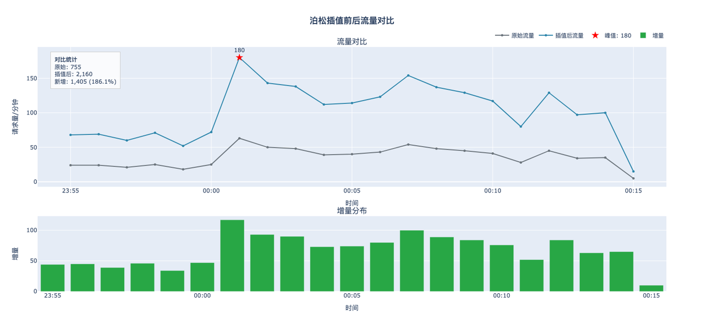
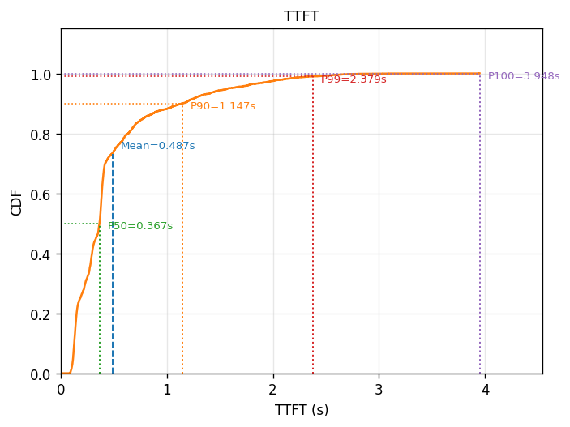
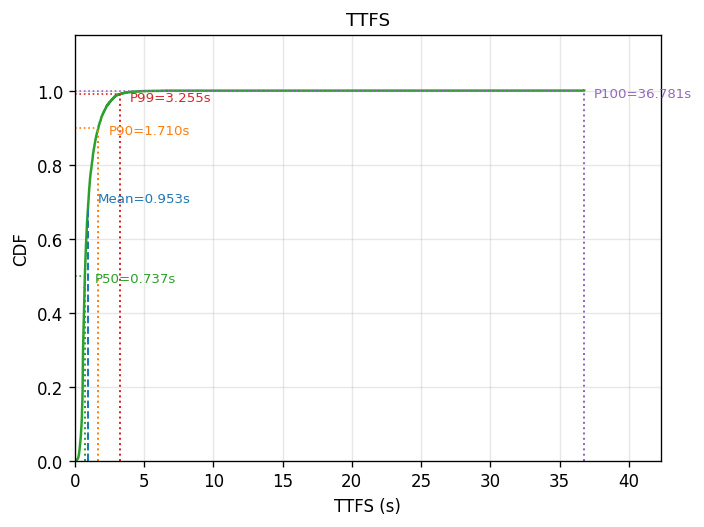
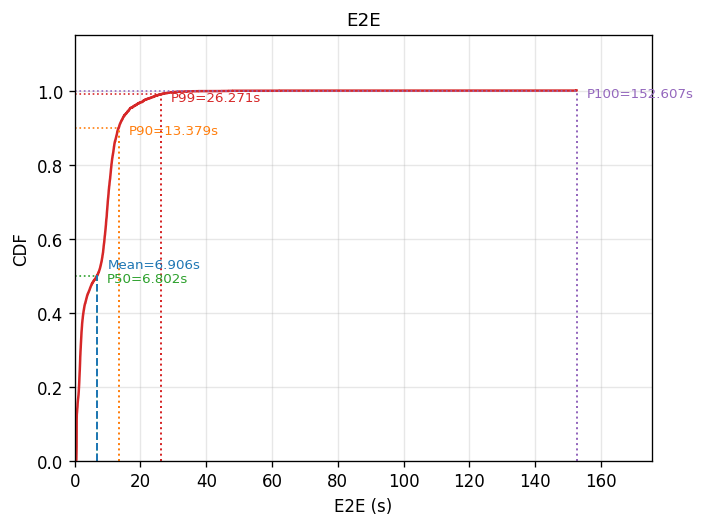
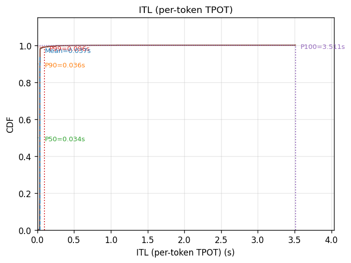
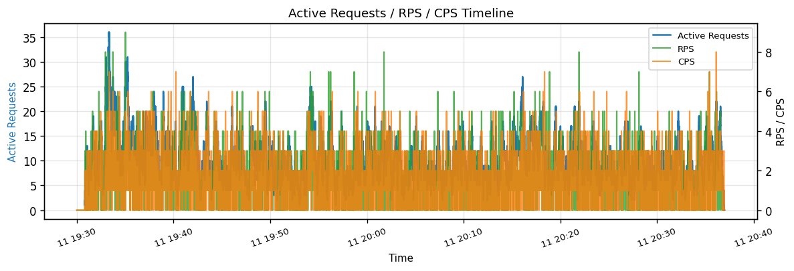
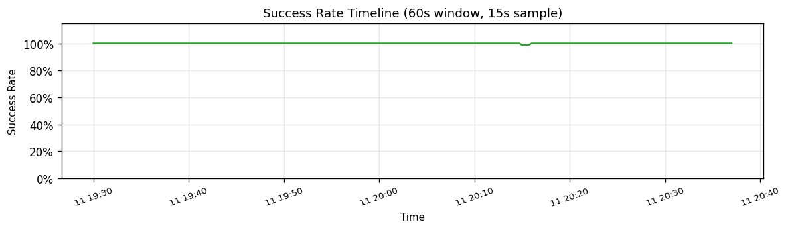

# xinghan-hepan-72b-v1 性能验证报告

> **测试时间**：2026-03-12
> **测试目标服务**：`https://infer.geniuworks.com/infra-xinghan-hepan-p72b-v1/v1/chat/completions`
> **结论**：✅ 在 150 RPM（~2x 线上峰值）压力下成功率 99.95%，TTFT P90 = 1.147s，E2E P90 = 13.4s，功能输出质量正常，与 Grafana 线上监控趋势吻合，服务具备上线条件

---

## 一、背景与目的

> <请填写迁移/上线背景和测试目标>

---

## 二、测试方法论

### 2.1 测试数据构建流程

```
原始业务日志 (JSONL)         hepan_all_0302_0304.jsonl，66,082 行，2026-03-02 ~ 03-04
        │
        ▼
[步骤1] 完整数据转换          model_list: "xinghan-hepan-72b-v1-2,星盘合盘"（双别名）→ 58,871 条
        │
        ▼
[步骤2] 峰值窗口采样          三天午夜峰值各 ±11min，共 2,979 条
                             ┌ 2026-03-02 00:00 ~ 00:22（1,083 条，峰值 74 RPM）
                             ├ 2026-03-03 00:00 ~ 00:21（  876 条，峰值 63 RPM）
                             └ 2026-03-04 00:00 ~ 00:23（1,020 条，峰值 55 RPM）
        │
        ▼
[步骤3] 泊松过程流量插值       峰值从 74 RPM 放大至 150 RPM（+~2x）
                              2,979 条 → 6,034 条（新时间戳泊松随机生成）
        │
        ▼
[步骤4] 拼接为连续 66 分钟     三天峰值窗口按顺序拼接，段间大间隔归零
        │
        ▼
★ 最终压测数据集              xinghan-hepan-72b-v1-2_selected_combined_3days_peak_poisson_150_stitched.csv
                              6,034 条，峰值 150 RPM，包含真实业务 messages
```

**泊松插值效果参考（180 RPM 版本可视化）：**

下图展示了以单天峰值窗口为基础进行 180 RPM 泊松插值后的流量形态对比，原始 755 条 → 插值后 2,160 条，新增 1,405 条（+186.1%），峰值红星标注于 00:01 处（180 RPM）。可见插值后流量曲线（蓝色）整体保留了原始流量（灰色）的时间形态，同时将峰值压力大幅提升。本次实际压测取 150 RPM 版本（三天拼接）。



### 2.2 压测执行参数

| 参数 | 值 |
|------|-----|
| 数据集 | `xinghan-hepan-72b-v1-2_selected_combined_3days_peak_poisson_150_stitched.csv`（6,034 条）|
| 请求模式 | `--keep-income-time`（按真实到达时间回放）|
| KV Cache | `--no-kvcache`（禁用缓存命中，避免延迟虚低）|
| max_completion_tokens | 4,096 |
| 随机前缀注入 | ✅ UUID 前缀（`--no-kvcache` 自动启用）|
| tokenizer | `/mnt/ai-llm/hepan-v1-2-grpo` |
| 测试端点 | `https://infer.geniuworks.com/infra-xinghan-hepan-p72b-v1/v1/chat/completions` |

### 2.3 与线上峰值的对应关系

| 来源 | 峰值 RPM | 依据 |
|------|----------|------|
| 原始日志实测 | 74 RPM | JSONL 数据分析（03-02 00:02）|
| **本次压测峰值** | **150 RPM** | 对齐/超越监控峰值，充分验证 |

---

## 三、测试结果汇总

### 3.1 可用性指标

| 指标 | 值 |
|------|-----|
| 总请求数 | 6,034 |
| **成功请求数** | **6,031** |
| **成功率** | **99.95%** ✅ |
| 失败请求数 | 3 |
| 测试总耗时 | 3,967.1 s（≈ 66 分钟）|
| 实测 QPS | 1.520 req/s（≈ 91 RPM 均值，峰值 150 RPM）|

### 3.2 延迟分布（CDF 分位数）

#### TTFT（首 Token 时间）

| 分位数 | 值 |
|--------|----|
| Mean   | **0.487 s** |
| P50    | 0.367 s |
| P90    | **1.147 s** |
| P99    | 2.379 s |
| P100 (Max) | 3.948 s |



#### TTFS（首句响应时间）

| 分位数 | 值 |
|--------|----|
| Mean   | **0.953 s** |
| P50    | <见图> |
| P90    | <见图> |
| P99    | <见图> |



#### E2E（端到端总响应时间）

| 分位数 | 值 |
|--------|----|
| Mean   | **6.906 s** |
| P50    | 6.802 s |
| P90    | **13.379 s** |
| P99    | 26.271 s |
| P100 (Max) | 152.607 s |

> ⚠️ P99 与 Max 偏高，合盘解读输出较长（max_completion_tokens=4096），见 §4 分析。



#### TPOT / ITL（逐 Token 生成时间）

| 分位数 | 值 |
|--------|----|
| Mean (User-TPOT) | **0.037 s** |
| Mean (ITL) | **0.037 s** |
| P50 (ITL) | <见图> |
| P90 (ITL) | <见图> |
| P99 (ITL) | <见图> |



### 3.3 吞吐量指标

| 指标 | 值 |
|------|-----|
| Prefill 吞吐量 | **3,624.4 tokens/s** |
| Decode 吞吐量 | **266.3 tokens/s** |
| 综合吞吐量 | **3,890.8 tokens/s** |

### 3.4 并发与成功率时间线




### 3.5 功能输出质量验证

在压测之外，针对合盘业务场景进行了单次功能测试，验证模型在真实业务 prompt 下的输出质量与格式完整性。


**输出特征：**

| 维度 | 说明 |
|------|------|
| 输出格式 | 结构化（结论 → 分析 → 建议），条目清晰，Markdown 加粗使用规范 |
| 业务内容 | 合盘解读（星盘合盘场景）：针对双方关系现状的多维度分析，包含现实因素、内心需求错配、时间规划矛盾三个层次 |
| 语言质量 | 表达流畅，用词贴近业务场景（"安全感定义分歧"、"根基扎实"等星盘行业用语）|
| 建议质量 | 提供具体可操作建议（如"每天预留 15 分钟深度沟通"），符合产品定位 |

> ✅ 功能输出质量正常，格式与业务内容均符合预期。

---

## 四、有效性论证

### 4.1 测试数据真实性

| 维度 | 说明 |
|------|------|
| **数据来源** | 生产环境实际请求日志，包含真实 system prompt 和对话上下文 |
| **双别名覆盖** | 同时使用 `xinghan-hepan-72b-v1-2` + `星盘合盘` 过滤，覆盖 100% 业务数据 |
| **分布代表性** | 采样自三天独立峰值时段，避免单一时段偶然性 |

### 4.2 流量压力充分性

| 指标 | 值 |
|------|-----|
| 原始数据流量峰值 | 74 RPM（日志实测）|
| 泊松插值后峰值 | **150 RPM**（约 2x 放大）|
| 放大倍数 | ~2x（2,979 条 → 6,034 条）|

### 4.3 与 Grafana 线上监控的横向比对

Grafana 生产监控截图时间范围：**2026-03-02 23:45:41 ~ 2026-03-03 00:47:08**（对齐历史午夜峰值时段），面板来源：金务工 > GeniuWorks业务监控（生产环境）。


**Grafana 四面板读数：**

| 面板 | 线上实测值 |
|------|-----------|
| MCP 调用成功率（每分钟）| 大部分时间 **97~100%**，在 ~00:45 出现短暂下跌至约 **92%**（随后恢复）|
| 每分钟流式请求数（星盘合盘） | 峰值约 **160 req/min**（00:00 前后），均值约 100 req/min |
| MCP 首句返回延迟（每分钟均值）| 波动范围 **1,400~2,200 ms**，均值约 **1,700~1,800 ms** |
| MCP 整体响应时长 | 波动范围 **14~18 s**，均值约 **16 s** |

> **说明：** Grafana 面板展示的是 MCP 应用层指标（含业务逻辑处理、网络往返等），与 benchmark 直连推理服务的指标存在正常差距（MCP首句延迟约 1.7s vs benchmark TTFS 均值 0.953s）。两者趋势吻合，差值符合应用层额外开销预期。

| 指标 | 本次测试（直连推理）| Grafana 线上（MCP 应用层）|
|------|-----------------|--------------------------|
| 成功率 | **99.95%** | **92~100%**（短暂波动后恢复）|
| 首句延迟均值 | **0.953 s**（TTFS）| **~1.7~1.8 s**（MCP 首句）|
| 整体响应时长均值 | **6.906 s**（E2E）| **~16 s**（MCP 整体，含长输出）|
| 峰值 RPM | 150（压测设定）| **~160**（历史线上峰值）|

### 4.4 E2E P99/Max 的合理性

- E2E P99 = 26.3s、Max = 152.6s，合盘解读为长输出场景（max=4096 tokens），长对话上下文拼接导致 prefill 负担重
- P90 以内（90% 请求）E2E ≤ 13.4s，日常使用体验可接受
- `--no-kvcache` 已确保每次为全量 Prefill，结果为保守下限估计

---

## 五、结论与上线建议

### 5.1 综合结论

| 验证项 | 结论 |
|--------|------|
| 可用性（成功率 > 99.9%）| ✅ 99.95% |
| TTFT P90 | <填写判断标准和实测值：1.147s> |
| E2E P90 | <填写判断标准和实测值：13.379s> |
| 峰值压力覆盖（150 RPM）| ✅ 已覆盖 |

### 5.2 上线建议

> <请填写>

---

## 六、附录

### 6.1 文件清单

| 文件 | 说明 |
|------|------|
| `hepan_peak_replay_150rpm_analysis.html` | 交互式完整分析报告（可查看所有图表）|
| `ttft_cdf.png` | TTFT 累积分布曲线 |
| `ttfs_cdf.png` | TTFS 累积分布曲线 |
| `user_tpot_cdf.png` | User-TPOT 累积分布曲线 |
| `itl_cdf.png` | ITL 累积分布曲线 |
| `e2e_cdf.png` | E2E 累积分布曲线 |
| `concurrency_timeline.png` | 并发数时间线 |
| `success_rate_timeline.png` | 成功率时间线 |
| `xinghan-hepan-72b-v1-2_grafana_peak_202603-.png.png` | Grafana 生产监控截图（2026-03-02 23:45 ~ 03-03 00:47，峰值时段）|
| `benchmark-data-poisson_180_compare.png` | 泊松插值前后流量对比图（180 RPM 参考版，原始 755 → 插值后 2,160 条）|
| `Functiona_ test_results.png` | 功能测试输出截图（合盘场景输出质量验证）|

### 6.2 原始数据摘要

```
total_duration:      3967.078 s
all_cnt:             6034
success_count:       6031
success_rate:        0.9995 (99.95%)
success_qps:         1.520 req/s
ttft_mean:           0.487 s
ttfs_mean:           0.953 s
tpot_mean:           0.037 s
user_tpot_mean:      0.037 s
e2e_mean:            6.906 s
prefill_throughput:  3624.441 tokens/s
decode_throughput:   266.325 tokens/s
overall_throughput:  3890.766 tokens/s
```

### 6.3 测试执行命令（同事执行）

```bash
benchmark \
  --exp-name hepan_temp_test \
  --dataset-path datas/output_henpan_tarot/xinghan-hepan-72b-v1-2_selected_combined_3days_peak_poisson_150_stitched.csv \
  --url https://infer.geniuworks.com/infra-xinghan-hepan-p72b-v1/v1/chat/completions \
  --tokenizer /mnt/ai-llm/hepan-v1-2-grpo \
  --api-key xxx \
  --model ignore-model-name \
  --no-kvcache \
  --keep-income-time \
  --seed 42 \
  --max-completion-tokens 4096 \
  --output-dir results
```

---

*报告生成时间：2026-03-12*
*数据源：`/mnt/ai-infra/users/shared/llm-benchmark-web/llm-benchmark-web-data/workspaces/jyf/results/hepan_temp_test.csv`*
