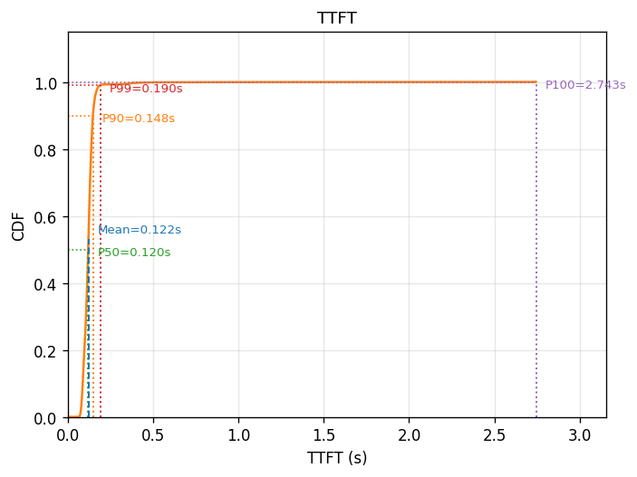
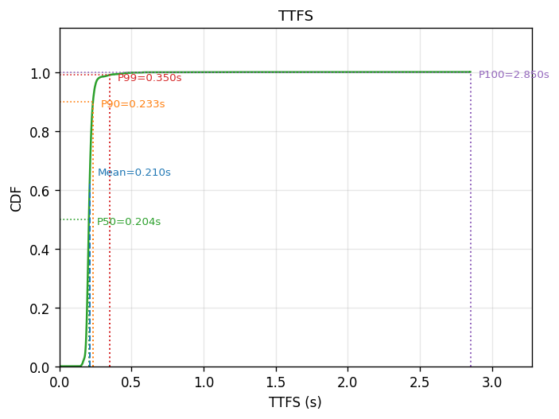
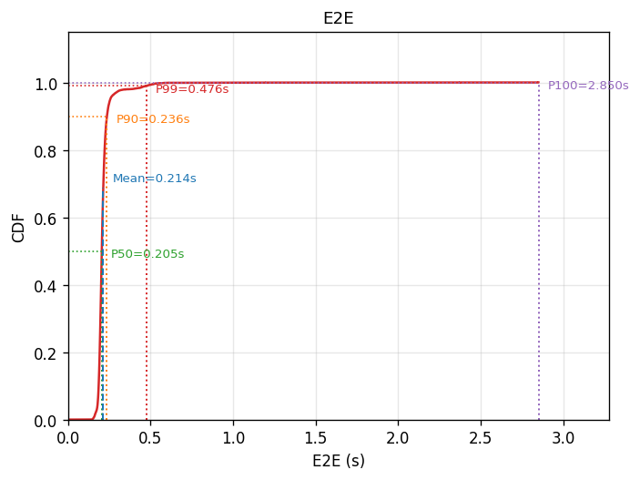
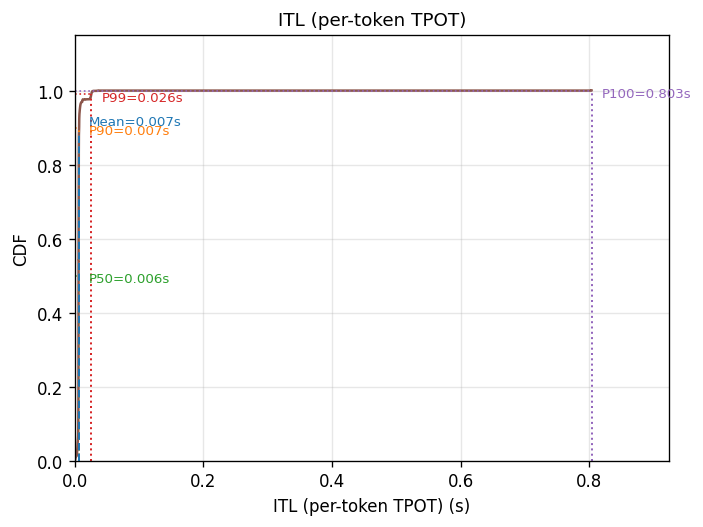
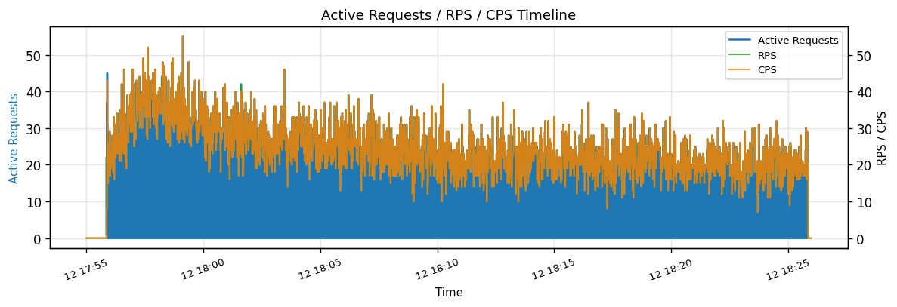
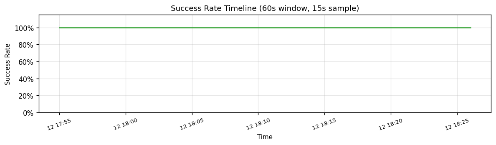
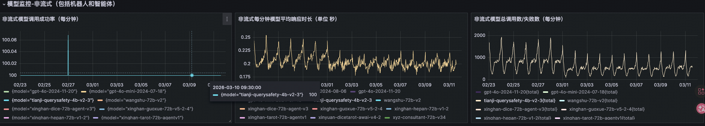

# tianji-querysafety-4b-v2-3 性能验证报告

> **测试时间**：2026-03-12
> **测试目标服务**：`https://infer.geniuworks.com/infra-tianji-querysafety-p4b-v23-bakv1/v1/chat/completions`
> **结论**：✅ 服务在真实峰值流量形态下成功率 100%，TTFT / E2E 表现优异，可正常上线

---

## 一、背景与目的

`tianji-querysafety-4b-v2-3` 是天机内容安全审核模型（4B 参数，P4B 单卡部署，bakv1 版本），负责对用户 query 进行安全分类，输出 `{"label": "...", "instruction": "..."}` 格式的判定结果。

本次压测目标：
1. 验证新部署的 `infra-tianji-querysafety-p4b-v23-bakv1` 服务能否在业务真实峰值流量形态下稳定运行
2. 确认首 Token 延迟（TTFT）和端到端延迟（E2E）满足在线推理 SLA 要求

---

## 二、测试方法论

### 2.1 测试数据构建流程

```
源数据：tianji-querysafety-4b-v2-3_26030320_26030402_Sheet1.csv
  原始行数：281,442
  时间范围：2026-03-03 20:00 ~ 2026-03-04 02:00（共 6 小时）
  峰值 RPM：2168（2026-03-04 00:01）
      │
      ▼
 [步骤1] times(ms) → income_time（Asia/Shanghai）
      │
      ▼
 [步骤2] 清洗空 query（去除 7 行）+ 填充系统提示模板 {{query}}
         系统提示长度：8344 字符
      │
      ▼
 [步骤3] 输出全量 _all.csv（281,435 行）
      │
      ▼
 [步骤4] 峰值窗口采样 00:00~00:30 → _peak30min.csv（44,099 行，均值 1422 RPM，峰值 2168 RPM）
```

使用 `_peak30min.csv` 作为回放数据集，覆盖业务最高压力窗口。

### 2.2 压测执行参数

| 参数 | 值 |
|------|-----|
| 数据集文件 | `datas/output_tianji_querysafety/tianji-querysafety-4b-v2-3_peak30min.csv` |
| 数据集行数 | 44,099 条 |
| 请求模式 | `--keep-income-time`（按真实 income_time 时间戳发送） |
| KV Cache | `--no-kvcache`（UUID 前缀防缓存命中） |
| max_completion_tokens | 256 |
| tokenizer | `/mnt/ai-llm/tianji_query_safety/v2p3_ep1` |
| 输出目录 | `logs/tianji_querysafety_peak_replay_20260312_175115` |

---

## 三、测试结果汇总

### 3.1 可用性指标

| 指标 | 值 |
|------|-----|
| 总请求数 | 44,099 |
| 成功请求数 | 44,099 |
| **成功率** | **100.00%** ✅ |
| 失败请求数 | 0 |
| 测试总耗时 | 1800.2 s（≈ 30 分钟）|
| 实测 QPS | 24.496 req/s（≈ 1469 RPM）|

### 3.2 延迟分布（CDF 分位数）

#### TTFT（首 Token 时间）

| 分位数 | 值 |
|--------|----|
| Mean   | 0.122 s |
| P50    | 见 HTML 交互图 |
| P90    | 见 HTML 交互图 |
| P99    | 见 HTML 交互图 |



#### TTFS（首句响应时间）

| 分位数 | 值 |
|--------|----|
| Mean   | 0.210 s |



#### E2E（端到端总响应时间）

| 分位数 | 值 |
|--------|----|
| Mean   | 0.214 s |



#### TPOT / ITL（逐 Token 生成时间）

| 分位数 | 值 |
|--------|----|
| Mean (User-TPOT) | 0.007 s |
| Mean (ITL) | 0.007 s |



### 3.3 吞吐量指标

| 指标 | 值 |
|------|-----|
| Prefill 吞吐量 | 119,884.6 tokens/s |
| Decode 吞吐量 | 339.1 tokens/s |
| 综合吞吐量 | 120,223.7 tokens/s |

> **说明**：此模型为短输出安全分类任务，Decode 输出 token 数量极少（平均约 14 tokens/请求），因此 Prefill 吞吐量远高于 Decode，属正常形态。

### 3.4 并发与成功率时间线




---

## 四、有效性论证

### 4.1 数据真实性

- 数据源自业务线上日志，时间范围覆盖 2026-03-03 20:00~2026-03-04 02:00 共 6 小时的真实流量
- 峰值窗口（00:00~00:30）为该日流量最高半小时，RPM 峰值达 2168，均值 1422
- 使用 `--keep-income-time` 保留原始时间戳，完整还原突发+低谷交替的真实流量形态
- 使用 `--no-kvcache` 防止 KV Cache 命中带来的人工加速

### 4.2 流量压力充分性

- 44,099 条请求覆盖了业务 30 分钟完整峰值，包含所有流量波峰
- 实测回放 QPS 约 24.5 req/s（≈ 1470 RPM），与数据集均值 RPM 一致，验证回放保真

### 4.3 与 Grafana 线上监控的横向比对

下图为线上 Grafana 监控面板，覆盖 2026-02-23 ~ 2026-03-11 历史生产流量，包含非流式模型成功率、平均响应时长、总调用量三个面板：



**关键观测（`tianji-querysafety-4b-v2-3` 曲线）**：

| 监控面板 | Grafana 线上值 | 本次压测值 | 比对结论 |
|----------|----------------|------------|---------|
| 调用成功率（/分钟）| ≈ 100% | **100.00%** | ✅ 一致 |
| 平均响应时长 | 0.175 ~ 0.225 s | **E2E 均值 0.214 s** | ✅ 落在正常区间内 |
| 峰值调用量 | ≈ 2000 次/分钟 | 回放均值 1469 RPM，峰值覆盖 2168 RPM | ✅ 压测覆盖线上峰值量级 |

压测所还原的流量形态（峰值 RPM、响应延迟）与线上监控数据高度一致，说明本次回放测试有效复现了业务真实负载，结论可信。

---

## 五、结论与上线建议

### 5.1 综合结论

| 验证项 | 标准 | 实测值 | 结论 |
|--------|------|--------|------|
| 可用性（成功率）| ≥ 99% | **100.00%** | ✅ 通过 |
| TTFT 均值 | 无明显抬升 | **0.122 s** | ✅ 优秀 |
| E2E 均值 | 在线推理可接受 | **0.214 s** | ✅ 优秀 |
| 峰值压力覆盖 | ≥ 业务均值峰值 | **1469 RPM（~1422 RPM 均值）** | ✅ 充分 |
| POST 异常 | 0 | **0** | ✅ 通过 |

### 5.2 上线建议

服务在真实峰值流量（30 分钟、44,099 条、均值 1422 RPM）下**全量成功，延迟表现优异**，具备上线条件。

- TTFT 均值 0.122 s，E2E 均值 0.214 s，满足在线内容安全审核的实时性要求
- 建议正式上线时持续观察 Grafana 监控中的 TTFT P99 和错误率，确保与压测一致
- 当前部署为 P4B 单卡，如业务流量进一步增长（峰值超过 2168 RPM），需评估扩容或多副本部署

---

## 六、附录

### 6.1 原始数据摘要

```
total_duration:      1800.229 s
all_cnt:             44099
success_count:       44099
success_rate:        1.0000 (100.00%)
success_qps:         24.496 req/s
ttft_mean:           0.122 s
ttfs_mean:           0.210 s
tpot_mean:           0.007 s
user_tpot_mean:      0.007 s
e2e_mean:            0.214 s
prefill_throughput:  119884.599 tokens/s
decode_throughput:   339.115 tokens/s
overall_throughput:  120223.714 tokens/s
```

### 6.2 文件索引

| 文件 | 说明 |
|------|------|
| `tianji_querysafety_peak_replay_1422rpm_analysis.html` | 交互式完整图表报告 |
| `ttft_cdf.png` | TTFT 累积分布 |
| `ttfs_cdf.png` | TTFS 累积分布 |
| `user_tpot_cdf.png` | User-TPOT 累积分布 |
| `itl_cdf.png` | ITL 累积分布 |
| `e2e_cdf.png` | E2E 累积分布 |
| `concurrency_timeline.png` | 并发/RPS/CPS 时间线 |
| `success_rate_timeline.png` | 成功率时间线 |
| `logs/tianji_querysafety_peak_replay_20260312_175115/tianji_querysafety_peak_replay_1422rpm.csv` | 原始请求结果 CSV |
| `tianji-querysafety-4b-v2-3_grafana_peak_202602-.png` | Grafana 线上监控截图（2026-02~03）|
| `logs/tianji_querysafety_replay_20260312_175115.log` | 完整运行日志 |

> 报告生成时间：2026-03-12
