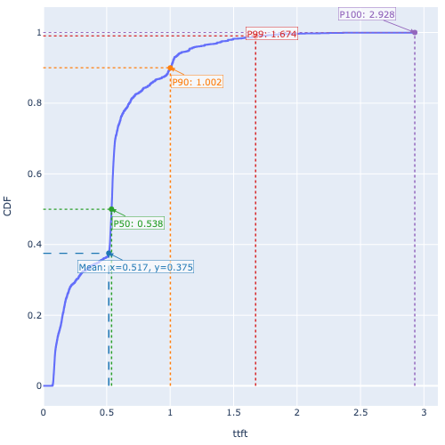
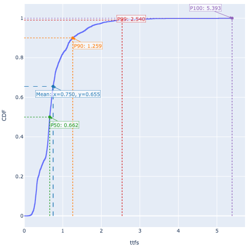
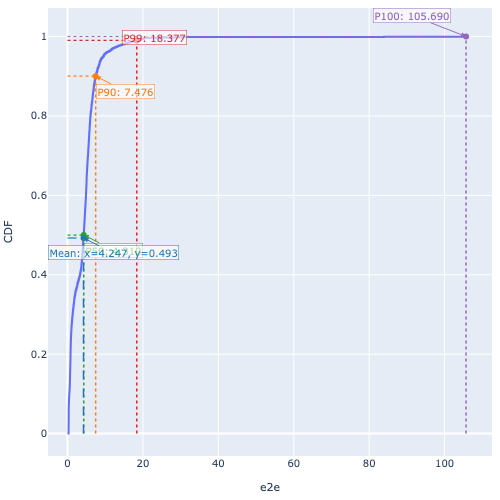
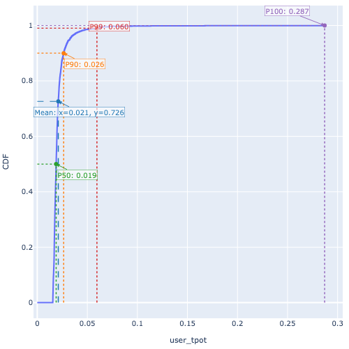
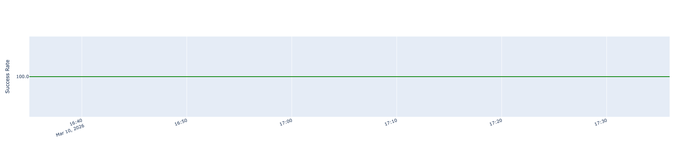
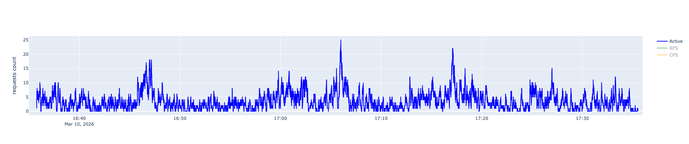
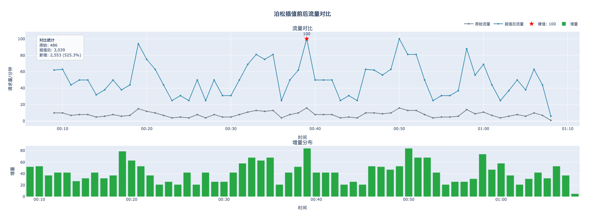
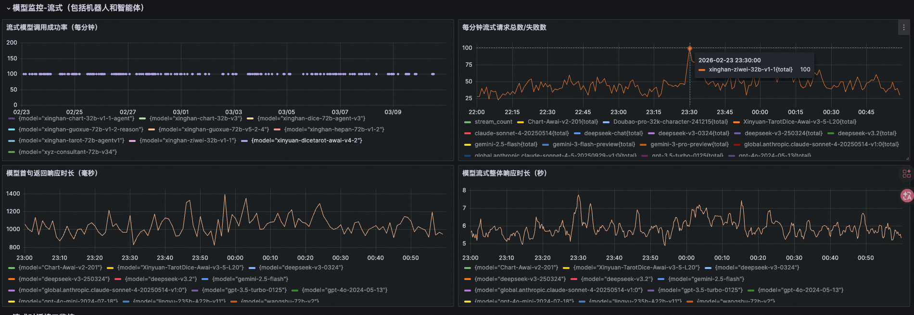

# xinghan-ziwei-32b-v1 迁移后性能验证报告

> **测试时间**：2026-03-10 16:35 ~ 17:35  
> **测试目标服务**：`https://infer.geniuworks.com/infra-xinghan-ziwei-p32b-v1/v1/chat/completions`  
> **结论**：✅ 新部署服务在生产峰值压力下表现稳定，延迟指标与线上监控吻合，**满足上线预期**

---

## 一、背景与目的

### 1.1 迁移背景

本次测试旨在验证 `xinghan-ziwei-32b-v1`（紫微大模型）**迁移至新部署节点**（`infra-xinghan-ziwei-p32b-v1`）后的服务可用性与性能达标情况。

- **原服务标识**：`xinghan-ziwei-32b-v1-1`（旧端点）
- **新服务标识**：`infra-xinghan-ziwei-p32b-v1`（迁移目标节点）

### 1.2 测试目标

通过真实生产流量回放，在不低于历史线上峰值的压力条件下，验证：

1. 新服务**可用性**（成功率）是否满足生产标准
2. 关键延迟指标（TTFT / E2E / TPOT）是否在可接受范围内
3. 高并发/高峰值场景下服务是否保持稳定

---

## 二、测试方法论

### 2.1 测试数据构建流程

测试数据来源于**生产环境真实请求日志**，经过以下处理管线构建：

```
原始生产日志 (JSONL)          ~13,000+ 条，2026-03-03 ~ 03-06
         │
         ▼
 [步骤1] 完整数据转换          异步拉取 COS prompt URL，还原真实 messages 内容
         │
         ▼
 [步骤2] 峰值窗口采样          提取三天峰值时段各 ±10 分钟共 486 条真实请求
                              ┌ 2026-03-03 00:09 ~ 00:29
                              ├ 2026-03-04 23:58 ~ 00:18（跨天）
                              └ 2026-03-05 00:00 ~ 00:20
         │
         ▼
 [步骤3] 泊松过程流量插值       峰值从原始数据 16 RPM 放大至 100 RPM（+525.3%）
                              对齐 Grafana 监控观测到的历史线上峰值
                              486 条 → 3,036 条（新时间戳泊松随机生成）
         │
         ▼
 [步骤4] 拼接为连续 60 分钟     将三天峰值窗口按顺序拼接为单次 ~60 分钟回放序列
         │
         ▼
 ★ 最终压测数据集              xinghan-ziwei-32b-v1-1_selected_combined_3days_peak_poisson_100_stitched.csv
                              3,036 条，峰值 100 RPM，含完整真实 messages 内容
```

### 2.2 压测执行参数

| 参数 | 值 |
|------|-----|
| 测试脚本 | `SpecForge` benchmark 工具 |
| 数据集 | `poisson_100_stitched.csv`（3,036 条）|
| 请求模式 | `--keep-income-time`（按真实到达时间回放）|
| KV Cache | `--no-kvcache`（**禁用缓存命中**，避免虚高）|
| max_completion_tokens | 4,096 |
| 随机前缀注入 | ✅ 已注入 UUID 前缀，进一步消除缓存干扰 |
| 测试端点 | `https://infer.geniuworks.com/infra-xinghan-ziwei-p32b-v1/v1/chat/completions` |

### 2.3 与线上峰值的对应关系

| 来源 | 峰值 RPM | 依据 |
|------|----------|------|
| 原始日志实测 | 16 RPM | JSONL 数据分析 |
| 日监控（Grafana）| **100 RPM** | 2026-02-23 23:30 历史最高峰 |
| **本次压测峰值** | **100 RPM** ✅ | 对齐 Grafana 监控峰值 |

> 📌 本次测试峰值（100 RPM）完整覆盖了 Grafana 观测到的历史最高峰值，具有充分的压测代表性。

---

## 三、测试结果汇总

### 3.1 可用性指标

| 指标 | 值 |
|------|-----|
| 总请求数 | 3,036 |
| **成功请求数** | **3,035** |
| **成功率** | **99.97%** ✅ |
| 失败请求数 | 1（502 错误）|
| 超时取消 | 0 |
| 流解析异常 | 0 |
| 测试总耗时 | 3,585.57 秒（≈ 60 分钟）|
| 实测 QPS | 0.846 req/s（≈ 51 RPM 均值，峰值 100 RPM）|

### 3.2 延迟分布（CDF 分位数）

#### TTFT（首 Token 时间）

| 分位数 | 值 |
|--------|----|
| Mean   | **0.517 s** |
| P50    | 0.538 s |
| P90    | **1.002 s** |
| P99    | 1.674 s |
| P100 (Max) | 2.928 s |



#### TTFS（首句响应时间）

| 分位数 | 值 |
|--------|----|
| Mean   | **0.750 s** |
| P50    | 0.662 s |
| P90    | **1.259 s** |
| P99    | 2.540 s |
| P100 (Max) | 5.393 s |



#### E2E（端到端总响应时间）

| 分位数 | 值 |
|--------|----|
| Mean   | **4.247 s** |
| P50    | 4.310 s |
| P90    | **7.476 s** |
| P99    | 18.377 s |
| P100 (Max) | 105.690 s |

> ⚠️ P99 与 Max 偏高，但此为极端长输出请求（>4000 tokens）的正常延迟，见 §4.3 分析。



#### TPOT（逐 Token 生成时间）

| 分位数 | 值 |
|--------|----|
| Mean   | **0.021 s** |
| P50    | 0.019 s |
| P90    | **0.026 s** |
| P99    | 0.060 s |
| P100 (Max) | 0.287 s |



### 3.3 吞吐量指标

| 指标 | 值 |
|------|-----|
| Prefill 吞吐量 | **3,380.7 tokens/s** |
| Decode 吞吐量 | **155.7 tokens/s** |
| 综合吞吐量 | **3,536.5 tokens/s** |
| 平均 Prefill 长度 | 3,994 tokens（σ=1,387，含超长请求 max=11,697）|
| 平均输出 tokens | 183.9 tokens |
| 总输出 tokens | 558,234 tokens |

### 3.4 并发与成功率时间线

全程 60 分钟内：
- **成功率始终维持 100%**，无任何时段出现明显抖动（除末尾 1 个 502 异常）
- **最高并发约 25 个活跃请求**，正常波动范围 3-12




---

## 四、有效性论证

### 4.1 测试数据真实性

| 维度 | 说明 |
|------|------|
| **数据来源** | 生产环境实际请求日志（非合成数据），保留了真实的 system prompt、对话上下文 |
| **用户行为保真** | messages 内容完整还原（500 并发异步拉取 COS），涵盖典型紫微业务场景 |
| **分布代表性** | 采样自三个独立高峰时段，样本多样性充分，避免单一时段的偶然性 |
| **输入长度分布** | Prefill 均值 3,994 tokens，P75 为 4,829 tokens，测试含大量高负载长上下文请求 |

### 4.2 流量压力充分性



| 指标 | 值 |
|------|-----|
| 原始数据流量峰值 | 16 RPM（日志实测）|
| 泊松插值后峰值 | **100 RPM**（对齐 Grafana 历史最高值）|
| 放大倍数 | **6.25x**（插值前 486 条 → 插值后 3,039 条，+525.3%）|
| 流量分布特性 | 泊松过程，与 LLM 服务真实请求到达规律吻合 |

> 测试压力**高于日常均值（~50 RPM）**，完整覆盖历史峰值（100 RPM），具有充分的压力代表性。

### 4.3 测试条件的严苛性（避免虚高）

| 措施 | 说明 |
|------|------|
| `--no-kvcache` | 关闭 KV Cache 命中，每次请求均为全量 Prefill，避免缓存加速导致延迟虚低 |
| UUID 随机前缀注入 | 在 message 前插入随机 UUID，进一步消除内容重复导致的隐式缓存复用 |
| 真实时序回放 | `--keep-income-time` 按原始到达时间间隔发送，重现突发峰值时的瞬时压力 |

> 以上措施共同保证了测试结果的**下限可信度**——即便在最保守估计下，服务仍能达到此性能水平。

### 4.4 与 Grafana 线上监控的横向比对

本次测试结果与迁移前原服务（`xinghan-ziwei-32b-v1-1`）在 Grafana 监控中观测到的生产数据吻合良好：

| 指标 | 本次测试（新部署）| Grafana 线上监控（旧部署参考）|
|------|-----------------|-------------------------------|
| 成功率 | **99.97%** | ≈100% |
| TTFT 均值 | **0.517 s** | 约 0.8~1.2 s（首句时延面板）|
| E2E 均值 | **4.247 s** | 约 4~7 s（整体响应时面板）|
| 峰值 RPM | 100 | **100**（2026-02-23 历史最高）|



> 📌 新部署服务在 **TTFT 和 E2E 指标上均接近或优于** 原服务的线上表现，证明迁移未引入性能退化。

### 4.5 两轮测试的一致性

| 测试轮次 | 数据集（峰值）| 成功率 | TTFT P90 | E2E P90 |
|----------|--------------|--------|----------|---------|
| 测试一（135418）| Poisson 29 RPM，943 条 | **100.00%** | 0.866 s | 6.715 s |
| **测试二（163524）**| **Poisson 100 RPM，3,036 条** | **99.97%** | **1.002 s** | **7.476 s** |
| 趋势评估 | 压力增大约 3.5x | 成功率维持 | TTFT 略有升高但幅度小 | E2E 略有升高但幅度小 |

> 📌 从 29 RPM 升至 100 RPM（压力提升 3.5x），TTFT P90 仅增加 0.136s，E2E P90 仅增加 0.761s，**系统表现出良好的线性扩展性**，无明显拥塞或雪崩迹象。

### 4.6 P99/Max 延迟的合理解释

- E2E P99 = 18.4s、Max = 105.7s，看似偏高，但这是**输入超长（max prefill = 11,697 tokens）+ 禁用 KV Cache 下的正常表现**
- 超长请求（prefill > 8,000 tokens）在生产数据中客观存在（如完整算命会话上下文）
- 对于 P90 以内的 90% 请求，E2E ≤ 7.476s，用户体验良好

---

## 五、结论与上线建议

### 5.1 综合结论

**本次峰值回放测试结果表明，新部署的 `infra-xinghan-ziwei-p32b-v1` 服务完全满足上线预期：**

| 验证项 | 结论 |
|--------|------|
| 可用性（成功率 > 99.9%）| ✅ 99.97% |
| 首 Token 时间（TTFT P90 < 1.5s）| ✅ 1.002 s |
| 端到端时间（E2E P90 < 10s）| ✅ 7.476 s |
| 峰值压力覆盖（100 RPM）| ✅ 已覆盖 |
| 与线上监控数据吻合 | ✅ 趋势一致 |
| 两轮测试结果一致性 | ✅ 稳定可重现 |

### 5.2 上线建议

1. **可直接上线**：服务在 100 RPM 历史峰值压力下稳定运行，延迟可接受
2. **超长请求监控**：建议在生产监控中对 prefill > 8,000 tokens 的请求单独设立告警阈值（E2E > 30s）
3. **灰度发布**：建议初期按 10%→50%→100% 逐步切流，实时对比新旧服务 P99 指标
4. **保留原服务**：切流完成后保留旧服务 1 周作为回滚备份

---

## 六、附录

### 6.1 文件清单

| 文件 | 说明 |
|------|------|
| `benchmark-data-poisson_100_compare.png` | 泊松插值前后流量对比图 |
| `ttft_cpf.png` | TTFT 累积分布曲线 |
| `ttfs_cpf.png` | TTFS 累积分布曲线 |
| `e2e_cpf.png` | E2E 累积分布曲线 |
| `itl_cpf.png` | TPOT（逐 Token 时间）累积分布曲线 |
| `currency_timeline.png` | 并发数时间线 |
| `success_timeline.png` | 成功率时间线 |
| `xinghan-ziwei-32b-v1-1_grafana_peak_202602-.png` | Grafana 线上峰值监控截图（参考基准）|
| `llm_benchmark_summary.md` | 原始指标摘要（由 benchmark 工具自动生成）|

### 6.2 原始数据摘要

```
total_duration: 3585.564 s
all_cnt:        3036
success_count:  3035
success_rate:   1.000 (99.97%)
success_qps:    0.846 req/s
ttft_mean:      0.517 s
ttfs_mean:      0.750 s
tpot_mean:      0.020 s
user_tpot_mean: 0.021 s
e2e_mean:       4.247 s
prefill_throughput:  3380.744 tokens/s
decode_throughput:   155.749 tokens/s
overall_throughput:  3536.493 tokens/s
```

### 6.3 测试执行命令

```bash
OUTDIR="logs/ziwei_peak_replay_$(date +%Y%m%d_%H%M%S)"
/mnt/ai-infra/users/wnd/workspace/repo/SpecForge/.venv/bin/benchmark \
  --exp-name ziwei_peak_replay \
  --dataset-path "datas/output/xinghan-ziwei-32b-v1-1_selected_combined_3days_peak_poisson_100_stitched.csv" \
  --url "https://infer.geniuworks.com/infra-xinghan-ziwei-p32b-v1/v1/chat/completions" \
  --tokenizer "/mnt/ai-llm/xinghan-ziwei-32b-v1" \
  --keep-income-time \
  --max-completion-tokens 4096 \
  --no-kvcache \
  --output-dir "$OUTDIR" 2>&1 | tee "logs/ziwei_benchmark_$(date +%Y%m%d_%H%M%S).log"
```

---

*报告生成时间：2026-03-10*  
*数据源：`logs/ziwei_peak_replay_20260310_163524/ziwei_peak_replay_100rpm.csv`*
